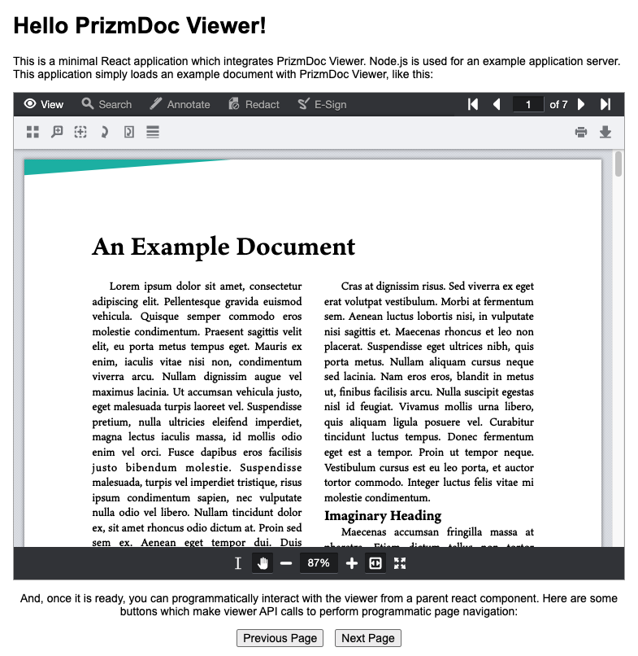

# Hello PrizmDoc Viewer with Node.js and React

A minimal React application which integrates PrizmDoc Viewer. Node.js is used for an example application server.

This sample shows you a simple way to contain the non-React PrizmDoc Viewer HTML control inside of a React "wrapper" component:

- `client/src/PrizmDocViewerWrapper.jsx` is the wrapper component which contains all of the viewer initialization code
- `client/src/App.jsx` shows an example usage of the wrapper component to render a viewer with a document

## Setup

### Requirements

- [Node.js](https://nodejs.org) 8 or higher

### Configure Connection to PAS

Configure the example application server's connection to PAS (PrizmDoc Application Services) by editing the `server/config.json5` file (this is just a JSON file with comments).

If you're just getting started, the easiest thing to do is to use [PrizmDoc Cloud](https://cloud.accusoft.com). We host PAS for you and all you need is your [PrizmDoc Cloud](https://cloud.accusoft.com) API key. If you don't have an API key, you can get one for free at https://cloud.accusoft.com.

For PrizmDoc Cloud:

```json
{
  "pasBaseUrl": "https://api.accusoft.com/prizmdoc",
  "apiKey": "YOUR_API_KEY"
}
```

For self-hosted PAS:

```json
{
  "pasBaseUrl": "YOUR_PAS_BASE_URL",
  "pasSecretKey": "YOUR_PAS_SECRET_KEY",
}
```

Alternately, you can set or override any of these values via environment variables:

- `API_KEY`
- `PAS_BASE_URL`
- `PAS_SECRET_KEY`

### Install dependencies

```
npm install
```

## Running the Sample

```
npm start
```

This will:

1. Perform a production build of the React application in the `client` directory
2. Launch the example application server on `http://localhost:8888`

You should see output like this:

```
> node index.js

[HPM] Proxy created: /pas-proxy  ->  https://api.accusoft.com/prizmdoc
[HPM] Proxy rewrite rule created: "^/pas-proxy" ~> ""
[HPM] Subscribed to http-proxy events:  [ 'error', 'close' ]
Application running at http://localhost:8888
```

When you open `http://localhost:8888` in a browser, you should see a viewer with an example document, like this:



## Developing Using the Client Dev Server

The instructions above performed a production build of the React client code and then started the application server using those pre-built client assets.

If you want to do development on the React application in the `client` directory, you can get faster feedback on your changes by using the built-in `create-react-app` development server, which supports automatic hot reloading of changes in the browser as you make changes to the code.

Here is how to use the client dev server:

### 1. Make Sure the Example Application Server Is Started

First, make sure the application server is running (if it is not already):

```
cd server
npm start
```

This will launch the example application server on `http://localhost:8888`.

### 2. Start the Client React App in Dev Mode

Given the application server is already running at `http://localhost:8888`, use a separate terminal window to start the client dev server like so:

```
cd client
npm start
```

This will launch the a client dev server at `http://localhost:3333` and open the page in your browser.

The dev server (on port `3333`) is configured to proxy all unrecognized routes to the application server (on port `8888`) so that the client can make REST API calls to the application server (this proxy setting is configured in `client/.env`).

## Building the Client for Production

To perform a production build of the client:

```
cd client
npm run build
```

This will create production client-side assets in `client/build`.
